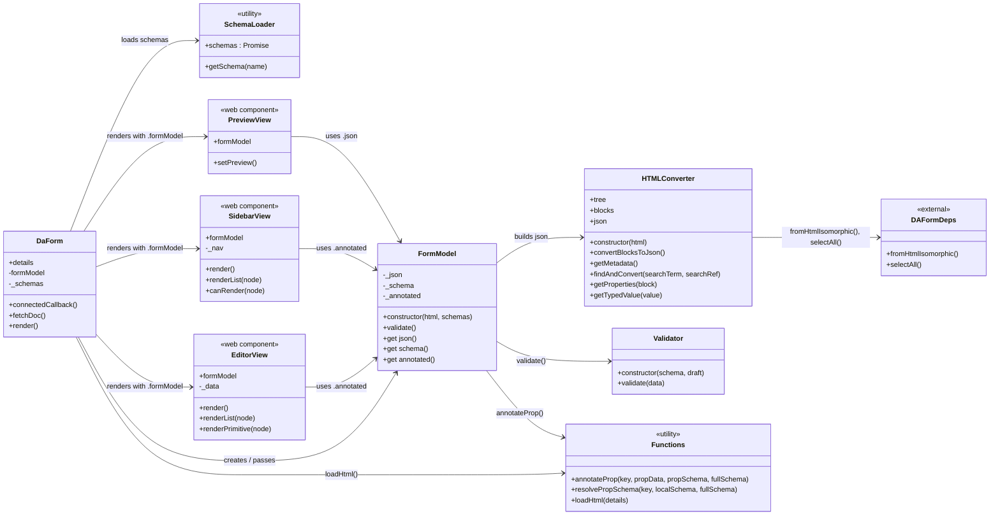

```mermaid
classDiagram
  direction LR

  class DaForm {
    +details
    -formModel
    -_schemas
    +connectedCallback()
    +fetchDoc()
    +render()
  }

  class FormModel {
    -_json
    -_schema
    -_annotated
    +constructor(html, schemas)
    +validate()
    +get json()
    +get schema()
    +get annotated()
  }

  class HTMLConverter {
    +tree
    +blocks
    +json
    +constructor(html)
    +convertBlocksToJson()
    +getMetadata()
    +findAndConvert(searchTerm, searchRef)
    +getProperties(block)
    +getTypedValue(value)
  }

  class Validator {
    +constructor(schema, draft)
    +validate(data)
  }

  class Functions {
    <<utility>>
    +annotateProp(key, propData, propSchema, fullSchema)
    +resolvePropSchema(key, localSchema, fullSchema)
    +loadHtml(details)
  }

  class SchemaLoader {
    <<utility>>
    +schemas : Promise<Record>
    +getSchema(name)
  }

  class EditorView {
    <<web component>>
    +formModel
    -_data
    +render()
    +renderList(node)
    +renderPrimitive(node)
  }

  class SidebarView {
    <<web component>>
    +formModel
    -_nav
    +render()
    +renderList(node)
    +canRender(node)
  }

  class PreviewView {
    <<web component>>
    +formModel
    +setPreview()
  }

  class DAFormDeps {
    <<external>>
    +fromHtmlIsomorphic()
    +selectAll()
  }

  DaForm --> FormModel : creates / passes
  DaForm --> EditorView : renders with .formModel
  DaForm --> SidebarView : renders with .formModel
  DaForm --> PreviewView : renders with .formModel
  DaForm --> SchemaLoader : loads schemas
  DaForm --> Functions : loadHtml()

  FormModel --> HTMLConverter : builds json
  FormModel --> Functions : annotateProp()
  FormModel --> Validator : validate()

  HTMLConverter --> DAFormDeps : fromHtmlIsomorphic(), selectAll()

  EditorView --> FormModel : uses .annotated
  SidebarView --> FormModel : uses .annotated
  PreviewView --> FormModel : uses .json
```

