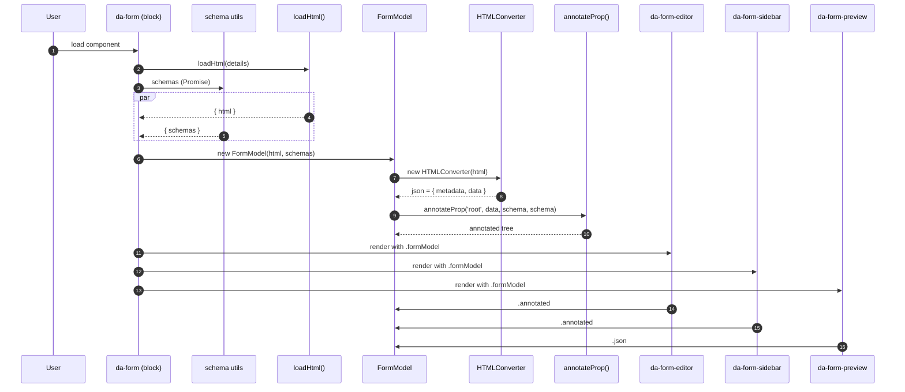

```mermaid
sequenceDiagram
  autonumber
  participant User
  participant DaForm as da-form (block)
  participant SchemaLoader as schema utils
  participant Utils as loadHtml()
  participant FormModel
  participant Converter as HTMLConverter
  participant Functions as annotateProp()
  participant Editor as da-form-editor
  participant Sidebar as da-form-sidebar
  participant Preview as da-form-preview

  User->>DaForm: load component
  DaForm->>Utils: loadHtml(details)
  DaForm->>SchemaLoader: schemas (Promise)
  par
    Utils-->>DaForm: { html }
    SchemaLoader-->>DaForm: { schemas }
  end
  DaForm->>FormModel: new FormModel(html, schemas)
  FormModel->>Converter: new HTMLConverter(html)
  Converter-->>FormModel: json = { metadata, data }
  FormModel->>Functions: annotateProp('root', data, schema, schema)
  Functions-->>FormModel: annotated tree
  DaForm->>Editor: render with .formModel
  DaForm->>Sidebar: render with .formModel
  DaForm->>Preview: render with .formModel
  Editor->>FormModel: .annotated
  Sidebar->>FormModel: .annotated
  Preview->>FormModel: .json
```

