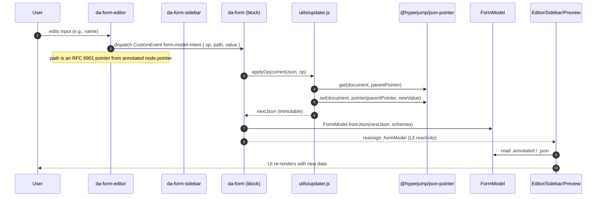

# Sequence: Event Intent to UI Update

```mermaid
sequenceDiagram
  autonumber
  participant User
  participant Editor as da-form-editor
  participant Sidebar as da-form-sidebar
  participant Parent as da-form (block)
  participant Updater as utils/updater.js
  participant Pointer as @hyperjump/json-pointer
  participant Model as FormModel
  participant Views as Editor/Sidebar/Preview

  User->>Editor: edits input (e.g., name)
  Editor->>Parent: dispatch CustomEvent form-model-intent { op, path, value }
  Note over Editor: path is an RFC 6901 pointer from annotated node.pointer

  Parent->>Updater: applyOp(currentJson, op)
  Updater->>Pointer: get(document, parentPointer)
  Updater->>Pointer: set(document, pointer|parentPointer, newValue)
  Updater-->>Parent: nextJson (immutable)

  Parent->>Model: FormModel.fromJson(nextJson, schemas)
  Parent-->>Views: reassign .formModel (Lit reactivity)

  Views->>Model: read .annotated / .json
  Views-->>User: UI re-renders with new data
```

